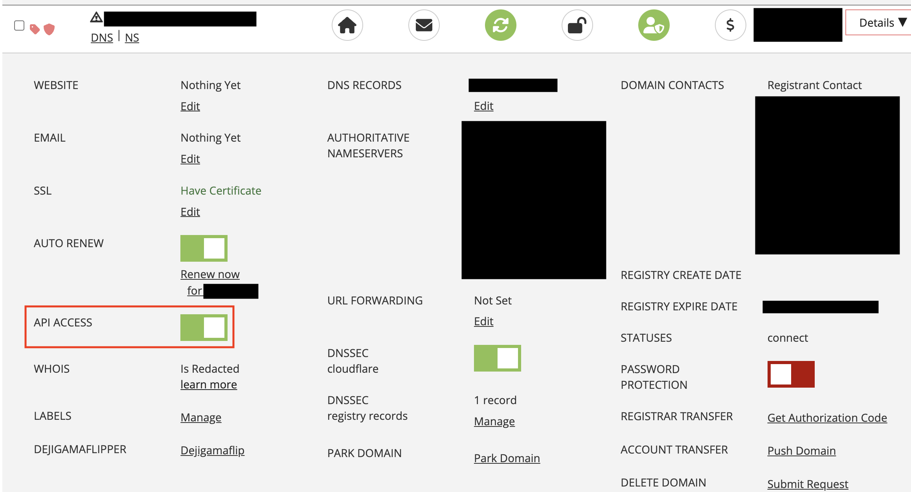

# Disclaimer

**This package is not related to or developed by Porkbun. No relationship between the developer of this package and Porkbun exists.**

**All trademarks, logos and brand names are the property of their respective owners. All company, product and service names used in this package are for identification purposes only. Use of these names,trademarks and brands does not imply endorsement.**

# Porkbun DDNS

`porkbun-ddns` is a unofficial DDNS-Client for Porkbun Domains.
This library will only update the records if the IP(s) have changed or the dns entry didn't exist before, it will also set/update A (IPv4) and AAAA (IPv6) records.


Since [porkbun-dynamic-dns-python](https://github.com/porkbundomains/porkbun-dynamic-dns-python) is deprecated I took it into my own hands to code a decent DDNS Client for Porkbun.
Inspired by [con-f-use](https://github.com/con-f-use) [pull request](https://github.com/porkbundomains/porkbun-dynamic-dns-python/pull/6), I built a pip Package and a docker container.

As alternative to cert-bun use my [lego-certbot](https://github.com/mietzen/lego-certbot) image.

## Setup on Porkbun

Make sure that any domain you use this client with has API access enabled. See the below picture for reference.



If this is not enabled, you'll see an error about your API keys being invalid, despite them being correct.

# CLI

**Minimum required python version: 3.10**

## Install via pip

```shell
pip install porkbun-ddns
```

## Usage

```Shell
usage: porkbun-ddns [-h] [-c CONFIG] [-e ENDPOINT] [-pk APIKEY] [-sk SECRETAPIKEY] [-i [PUBLIC_IPS ...]] [-f FRITZBOX] [-4 | -6] [-v] [--env_only] domain [subdomains ...]

positional arguments:
  domain                Domain to be updated
  subdomains            Subdomain(s)

options:
  -h, --help            show this help message and exit
  -c CONFIG, --config CONFIG
                        Path to config file (default: ~/.config/porkbun-ddns-config.json)
  -e ENDPOINT, --endpoint ENDPOINT
                        The endpoint
  -pk APIKEY, --apikey APIKEY
                        The Porkbun-API-key
  -sk SECRETAPIKEY, --secretapikey SECRETAPIKEY
                        The secret API-key
  -i [PUBLIC_IPS ...], --public-ips [PUBLIC_IPS ...]
                        Public IPs (v4 and or v6)
  -f FRITZBOX, --fritzbox FRITZBOX
                        IP or Domain of your Fritz!Box
  -4, --ipv4-only       Only set/update IPv4 A Records
  -6, --ipv6-only       Only set/update IPv6 AAAA Records
  -v, --verbose         Show Debug Output
  --env_only            Don't use any config, get all variables from the environment
```

### The parameter *endpoint*, *apikey*, *secretapikey*

These parameter are required for each run of the program. The program will take the values for these (in this order) from:

1. The command-line-arguments (`-pk pk1_xxx`)
2. The environment-variables (`export PORKBUN_APIKEY='pk1_xxx'`)
3. The config-file (`apikey="pk_xxx"`)

So if a value is set through the CLI and in the file, the CLI-value will be used. This allows for a default-configuration in the config-file, whose settings can be selectively overridden through enviromnment-variables or CLI-arguments.

### Examples

```shell
# using the default config-file in ~/.config/porkbun-ddns-config.json:
$ porkbun-ddns domain.com my_subdomain

# Using only environment variables:
# PORKBUN_APIKEY
# PORKBUN_SECRETAPIKEY
# PORKBUN_ENDPOINT (Optional)
$ porkbun-ddns domain.com my_subdomain --env_only

# Specific config-file:
$ porkbun-ddns domain.com my_subdomain -c "./config.json"

# Multiple subdomains:
$ porkbun-ddns domain.com my_subdomain_1 my_subdomain_2 my_subdomain_3

# Set root and subdomains:
$ porkbun-ddns domain.com @ my_subdomain_1 my_subdomain_2 my_subdomain_3

# Set IP's explicit
$ porkbun-ddns domain.com my_subdomain -i '1.2.3.4' '1234:abcd:0:4567::8900'

# Use Fritz!Box to obtain IP's and set IPv4 A Record only
$ porkbun-ddns "./config.json" domain.com my_subdomain -f fritz.box -4
```

You can set up a cron job get the full path to porkbun-ddns with `which porkbun-ddns`, then execute `crontab -e` and add the following line:

```
*/30 * * * * <PORKBUN-DDNS-PATH>/porkbun-ddns "<YOUR-PATH>/config.json" domain.com my.subdomain >/dev/null 2>&1
```

`config.json` example:

```
{
  "endpoint":"https://api.porkbun.com/api/json/v3",
  "apikey": "pk1_xxx",
  "secretapikey": "sk1_xxx"
}
```

# Docker compose

```yaml
services:
  porkbun-ddns:
    image: "mietzen/porkbun-ddns:latest"
    container_name: porkbun-ddns
    environment:
      DOMAIN: "domain.com" # Your Porkbun domain
      SUBDOMAINS: "my_subdomain,my_other_subdomain,my_subsubdomain.my_subdomain" # Subdomains comma spreaded
      SECRETAPIKEY: "<YOUR-SECRETAPIKEY>" # Your Porkbun Secret-API-Key
      APIKEY: "<YOUR-APIKEY>" # Your Porkbun API-Key
      # PUBLIC_IPS: "1.2.3.4,2001:043e::1" # Set if you got static IP's
      # FRITZBOX: "192.168.178.1" # Use Fritz!BOX to obtain Public IP's
      # SLEEP: "300" # Seconds to sleep between DynDNS runs
      # IPV4: "TRUE" # Set IPv4 address
      # DEBUG: "FALSE" # DEBUG LOGGING
    restart: unless-stopped

# # Uncomment below to let it detect ipv6 address:
#     networks:
#       - ipv6_enabled

# networks:
#   ipv6_enabled:
#     enable_ipv6: true

```

# Docker run

```shell
docker run -d \
  -e DOMAIN="domain.com" \
  -e SUBDOMAINS="my_subdomain,my_other_subdomain,my_subsubdomain.my_subdomain" \
  -e SECRETAPIKEY="<YOUR-SECRETAPIKEY>" \
  -e APIKEY="<YOUR-APIKEY>" \
  --name porkbun-ddns \
  --restart unless-stopped \
  mietzen/porkbun-ddns:latest
```

# Python

**Minimum required python version: 3.10**

```python
from pathlib import Path
from porkbun_ddns import PorkbunDDNS
from porkbun_ddns.config import Config, DEFAULT_ENDPOINT, extract_config


config = Config(DEFAULT_ENDPOINT, "YOUR-APIKEY", "YOUR-SECRETAPIKEY")
porkbun_ddns = PorkbunDDNS(config, 'domain.com')
# config = extract_config(Path("./config.json"))
# porkbun_ddns = PorkbunDDNS(config, 'domain.com')
# porkbun_ddns_ip = PorkbunDDNS(config, 'domain.com', public_ips=['1.2.3.4','1234:abcd:0:4567::8900'])
# porkbun_ddns_fritz = PorkbunDDNS(config, 'domain.com', fritzbox_ip='fritz.box', ipv6=False)

porkbun_ddns.set_subdomain('my_subdomain')
porkbun_ddns.update_records()
```
